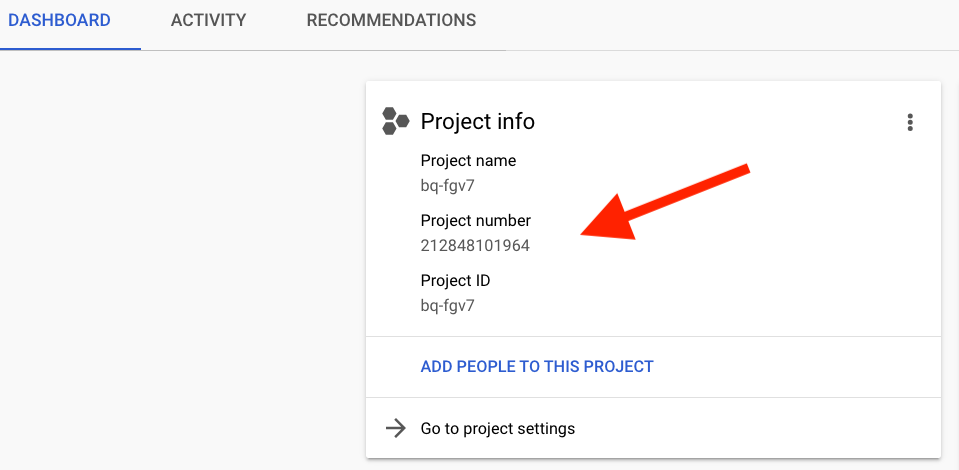
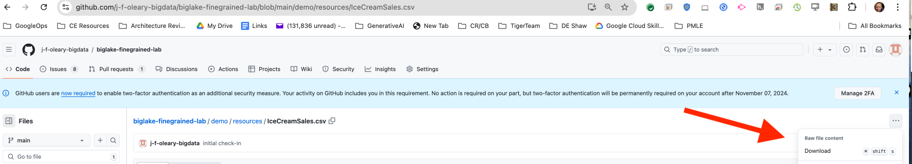
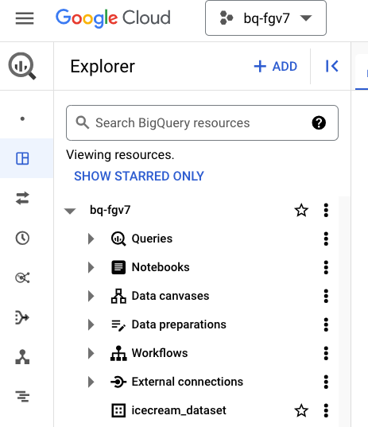
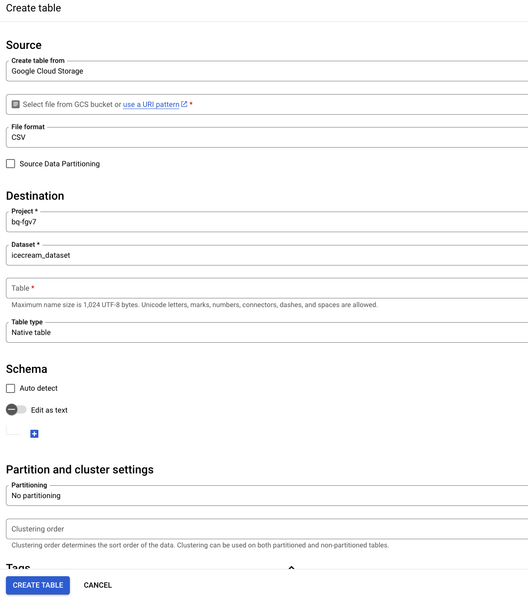
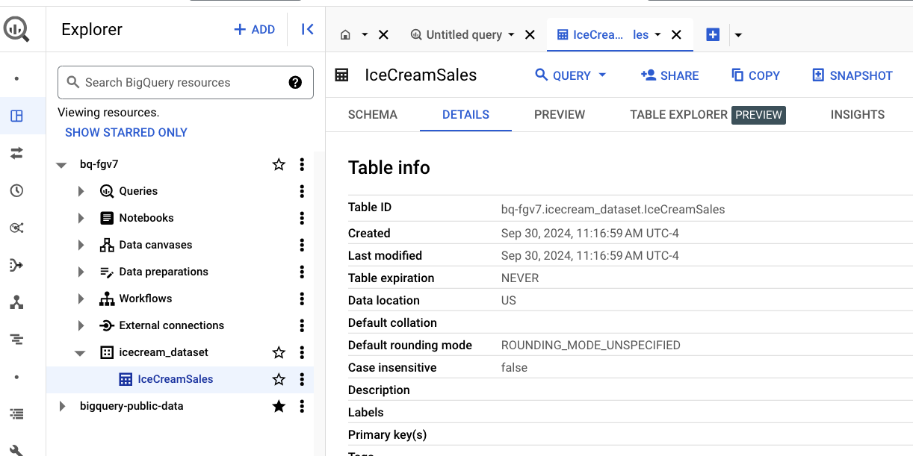
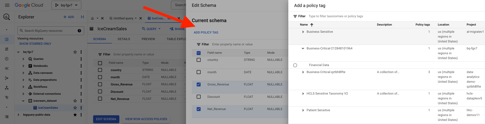

# About the lab<br>
This lab showcases fine-grained access control made possible by [BigLake](https://cloud.google.com/bigquery/docs/biglake-intro) with a minimum viable example of Icecream sales. 

### Use Case
Sales forecasting with Prophet

### Goals
1. Just enough knowledge of creating and using BigLake tables on files in Cloud Storage
2. Just enough knowledge of Row and Column Level Security setup with BigLake
3. Accessing BigQuery via SQL Commands
4. Just enough Terraform for automating provisioning, that can be repurposed for your workloads

### Lab Flow
 

### Dataset
Kaggle dataset for Icecream Sales

 

### Design
Row Level Security (RLS) and Column Level Security (CLS) is showcased. <br>

Three users are created as part of the lab, with finegrained access implemented-
1. usa_user@ - RLS & CLS: has access to all columns of data with Country in USA
2. aus_user@ - RLS & CLS: has access to all columns of data with Country in Australia
3. mkt_user@ - CLS: has access to all columns but Discount and Net_Revenue, but to data from all countries

TBD - SQL Queries

### Column Level Security 
The section covers Column Level Security setup.<br>

**1. What's involved** <br>

 

Effectively, only the users, usa_user@ and aus_user@ have access to columns IcecreamSales.Discount and IcecreamSales.Net_Revenue
<br>

**2. Taxonomy:** <br>

 

<br>

**3. Policy Tag:** 

 

<br>

**4. Table:**

 


<br>

**5. Grants:**

 


### Row Level Security 

The section covers Row Level Security setup.<br>

**1. What's involved** <br>

 

**2. Example** <br>

 

<br>

 

<br>

 


### Key Products
1. Cloud IAM - Users, groups, group memberships, roles
2. Cloud Storage - for CSV file
3. Dataplex Data Catalog - policy tag taxonomy, policy tag
4. BigQuery - finegrained row level and column level security Bigquery Native Table

### Technology & Libraries
1. Data preprocessing at scale: Spark, specifically PySpark

### Duration to run through the lab
~ 90 minutes

### Lab format
Fully scripted, with detailed instructions intended for learning, not necessarily challenging

### Credits

| # | Google Cloud Collaborators | Contribution  | 
| -- | :--- | :--- |
| 1. | Dataproc Product Management and Engineering (Antonio Scaramuzzino and Pedro Melendez) | Inspiration, vision and sample |
| 2. | Jay O' Leary, Customer Engineer | Automation of lab |
| 3. | Anagha Khanolkar, Customer Engineer | Architecture, Diagrams, Narrative, Lab Guide, Testing, Ux |

### Contributions welcome
Community contribution to improve the lab is very much appreciated. <br>

### Getting help
If you have any questions or if you found any problems with this repository, please report through GitHub issues.

<hr>


# BigQuery Finegrained Permissions Lab

## 1. Prerequisites 

### 1.1. Create a project
Note the project number and project ID. <br>
We will need this for the rest of the lab.

### 1.2. Grant yourself Security Administrator role<br>
This is needed for the networking setup.<br>
Go to Cloud IAM and through the UI, grant yourself security admin role.

### 1.3. Grant yourself Organization Policy Administrator at an Organization level<br>
This is needed to set project level policies<br>
In the UI, set context to organization level (instead of project)<br>
Go to Cloud IAM and through the UI, grant yourself Organization Policy Administrator at an Organization level.<br>
Don't forget to set the project back to the project you created in Step 1 above in the UI.

### 1.4. Create 3 user accounts<br>
Go To admin.google.com...<br>
* Click on 'Add a user'<br>
* And add a user as shown below:<br><br>
 

<br>
- You will add three users: <br>
1. One user with access to all USA records in the dataset <br>
2. One user with access to all Australia records in the dataset<br>
3. One marketing user with access to both USA and Australia recoreds but restricted to certain columns<br>
<br>
- While you can use any usernames you want, we recommend you use the following as we have tested with these: <br>
1. usa_user <br>
2. aus_user <br>
3. mkt_user <br>

<br>

### 1.5. Create Separate Chrome Profiles for the User Accounts
To make it easier to use the three different personas (users) we recommend you set up 3 profiles in your browser<br>
<br>
- To add a profile<br>
* click on your profile picture at the far right of the screen next to the vertical 3 dots. <br>
* Then click on '+ Add' at the bottom of the screen as shown below: <br>
 
<br>

We recommend you setup three profiles: <br>
1. One for the USA User
2. One for the Australia User
3. And one for the Marketing User

For more information see these instructions --> [Add Profile Instructions](https://support.google.com/chrome/answer/2364824?hl=en)

<hr>

## 2. Details about the environment that is setup by this module

### 2.1. Products/services used in the lab
The following services and resources will be created via Terraform scripts:

1. IAM groups for USA and Australia
  - alternately, you can use individual user id's.
2. IAM permissions for user principals and Google Managed default service accounts
3. GCS bucket for CSV Data
4. Dataplex Policy for Column level Access
5. BigQuery Dataset, Table and Row Level Policies
6. TBD - BQ SQL Queries 

### 2.2. Tooling

1. Terraform for automation
2. Cloud Shell for executing Terraform

<hr>

## 3. Provision the GCP environment 


### 3.a via the console

#### 3.1 Enable API's

    Go to the Google Cloud Console: https://console.cloud.google.com/apis   <BR>
    <BR>
    Search for the Google Cloud Data Catalog API with the string below: <BR>
      datacatalog.googleapis.com
    <BR>
    Click on 'Google Cloud Data Catalog API' and enable it if needed. <BR>
    <BR>

#### 3.2 Get and Record the Project Number

    <BR>
    Go the Google Cloud Console: https://console.cloud.google.com/home/dashboard
    <BR>

    Record the Project Number for your current project (shown in image below)<BR>

 

#### 3.3 Create BigQuery Policy Tag

    <BR>
    Go the Google Cloud Console: https://console.cloud.google.com/bigquery/policy-tags
    <BR>
    #1 Click on 'Create Taxonomy' - located at top middle of screen<BR>
    #2 Enter the following values:<BR>
    - Taxonomy Name: Business-Critical-<project number from above><BR>
    - Policy Tags/Tag Name: Financial Data<BR>
    <BR>
    Go the Google Cloud Console: https://console.cloud.google.com/bigquery/policy-tags
    <BR>
    Click on the Taxonomy you just created and click on the "Enforce Access Control" slider to enable column level security.

#### 3.4 Create Cloud Storage Bucket

    <BR>
    Go the Google Cloud Console: https://console.cloud.google.com/storage
    <BR>
    Click on the "Create" Button and create a bucket with the following name:
    -gcs-bucket-<project-number-from-above><BR>
    <BR>

#### 3.5 Download CSV Sample File

    <BR>
    Click on the IceCreamSales.csv file using this [link](https://github.com/j-f-oleary-bigdata/biglake-finegrained-lab/blob/main/demo/resources/IceCreamSales.csv) 
    <BR>
    Click on the the three elipsis on the right as shown below and download CSV 
 

#### 3.6 Upload CSV File to Cloud Storage Bucket

    <BR>
    Go the Google Cloud Console: https://console.cloud.google.com/storage<BR>
    <BR>
    Click on the bucket you created earlier (e.g. gcs-bucket-<your-project-number-from-above>)<BR>
    <BR>
    Click on the Upload Button and select 'Upload Files' to upload IceCreamSales.csv to the bucket

#### 3.6 Create the BigQuery Dataset

    <BR>
    Go the Google Cloud Console: https://console.cloud.google.com/bigquery<BR>
    <BR>
    Click on your project to expand the list<BR>
    <BR>
    Click on the vertical elipsis next to your project name <BR>
    <BR>
    Select 'Create Dataset'<BR>
    Enter the name in the Dataset ID field: icecream_dataset<BR>
    Leave everything else as is and hit the 'Create Dataset' button<BR>
    You should now see a new dataset called 'icecream_dataset' in the BigQuery UI, similar to below: <BR>
    <BR>
 
<BR>

#### 3.6 Create the BigQuery Table

    <BR>
    Go the Google Cloud Console: https://console.cloud.google.com/bigquery<BR>
    <BR>
    Click on the vertical elipsis next to the icecream_dataset<BR>
    <BR>
    Select 'Create Dataset'<BR>
    <BR>Enter the following Information:<BR>
    - For Source Select: Google Cloud Storage
    - Enter the path of your csv file on Cloud Storage
    - For File Format: Select CSV
    - For Table Enter: IceCreamSales.csv
    - For schema, move the slider to Edit as Text and enter the text below:<BR>
    ```
    [
            {
                "name": "country",
                "type": "STRING"
            },
            {
                "name": "month",
                "type": "DATE"
                },
            {
                "name": "Gross_Revenue",
                "type": "FLOAT"
            },
            {
                "name": "Discount",
                "type": "FLOAT"
            },
            {
                "name": "Net_Revenue",
                "type": "FLOAT"
            }
    ]

    ``` 
    <BR>
    Under Advanced Options for "Header Rows to Skip" Enter the value: 1
    <BR>
    Leave Everything else as the default and click 'Create Table' as shown below
    <BR>
 
  <BR>
  You should now see a new dataset Table 'IceCreamSales' in the BigQuery UI, similar to below: <BR>
 
<BR>

#### 3.6 Add Policy Tags to the BigQuery Table for Column Level Security

  <BR>
    Go the Google Cloud Console: https://console.cloud.google.com/bigquery<BR>
    <BR>
    Click on IceCreamSales Table and go to the 'SCHEMA' tab<BR>
    <BR>
    Click on 'Edit Schema'<BR>
    <BR>
    Select 'Gross_Revenue' and 'Net_Revenue' Columns<BR>
    <BR>
    Click on the 'ADD POLICY TAG' text as shown below <BR>
<BR>    

 
    <BR>
    Select 'Financial Data' next to the Taxonomy for your project and hit the SELECT button<BR>
    <BR>

#### 3.7 Add Row Level Security to the BigQuery Table for Row Level Security
    <BR>
    Go to the Google Cloud Console: https://console.cloud.google.com/ <BR>
    - Open the project picker: It's in the top bar, next to "Google Cloud Platform".<BR>
    -Your organization name should be at the top of the list. It might be displayed with your domain name.<BR>
    <BR>
    Go the Google Cloud Console: https://console.cloud.google.com/bigquery<BR>
    <BR>
    Click on IceCreamSales Table and go to the 'SCHEMA' tab<BR>
    <BR>
    Click on 'Query'<BR>
    <BR>
    Enter the Text Below:
    ```
       CREATE ROW ACCESS POLICY
        Australia_filter
        ON
        icecream_dataset.IceCreamSales
        GRANT TO
        ("group:australia-sales@<your-org-name-from-above>")
        FILTER USING
        (Country="Australia");

      CREATE ROW ACCESS POLICY
        US_filter
        ON
        icecream_dataset.IceCreamSales
        GRANT TO
        ("group:us-sales@<your-org-name-from-above>")
        FILTER USING
        (Country="United States");
      ```
    <BR>
    <BR>
    Click on IceCreamSales Table and go to the 'SCHEMA' tab<BR>
    <BR>
    Click on 'VIEW ROW ACCESS POLICIES'<BR>
    <BR>
    You should see the two policies you added above.

#### 3.8 Set User Permissions
    Go the Google Cloud Console: https://console.cloud.google.com/iam-admin<BR>
    Click on Grant Access<BR>
    Make the USA, Australia, and Marketing User Project Editors <BR>


#### 3.9 Check Row Level Security
    <BR>
    Log into the google cloud console as a user that is part of the us-sales group
    <BR>
    Go the Google Cloud Console: https://console.cloud.google.com/bigquery<BR>
    <BR>
    Click on IceCreamSales Table and go to the 'SCHEMA' tab<BR>
    <BR>
    Click on 'Query'<BR>
    <BR>
    Enter the Text Below:<BR>
    ```
    select 
      country, count(country) as count 
    from icecream_dataset.IceCreamSales
    GROUP BY country;
    ```
    <BR>
    Results Should look similar to the following:<BR>
    ```
    country       count        
    United States 1667
    ```
    <BR>

#### 3.9 Check Column Level Security
    <BR>
    Log into the google cloud console as a the marketing user
    <BR>
    Go the Google Cloud Console: https://console.cloud.google.com/bigquery<BR>
    <BR>
    Click on IceCreamSales Table and go to the 'SCHEMA' tab<BR>
    <BR>
    Click on 'Query'<BR>
    <BR>
    Enter the Text Below:<BR>
    ```
    select 
      country, count(country) as count 
    from icecream_dataset.IceCreamSales
    GROUP BY country;
    ```
    <BR>
    Results Should look similar to the following:<BR>
    ```
    country       count        
    United States 1667
    ```
    <BR>

### 3.b via Terraform

This section covers creating the environment via Terraform from Cloud Shell. 
1. Launch cloud shell
2. Clone this git repo
3. Provision foundational resources such as Google APIs and Organization Policies
4. Provision the GCP data Analytics services and their dependencies for the lab

### 3.1. Create a Cloud Shell Session
Instructions for launching and using cloud shell are available [here](https://cloud.google.com/shell/docs/launching-cloud-shell).

### 3.2. Clone the workshop git repo

```
cd ~
git clone -b bigquery_only https://github.com/j-f-oleary-bigdata/biglake-finegrained-lab
```

### 3.3. About the Terraform scripts

#### 3.3.1. Navigate to the Terraform directory
```
cd ~/biglake-finegrained-lab/
```

#### 3.3.2. Review the Terraform directory structure (& optionally, the content)

Browse and familiarize yourself with the layout and optionally, review the scripts for an understanding of the constructs as well as how dependencies are managed.

#### 3.3.3. What's involved with provisioning with Terraform

1. Define variables for use with Terraform
2. Initialize Terraform
3. Run a Terraform plan & study it
4. Apply the Terraform to create the environment
5. Validate the environment created

### 3.4. Provision the environment

#### 3.4.1. Define variables for use

Modify the below as appropriate for your deployment..e.g. region, zone etc. Be sure to use the right case for GCP region & zone.<br>
Make the corrections as needed below and then cut and paste the text into the Cloud Shell Session. <br>

```
PROJECT_ID=`gcloud config list --format "value(core.project)" 2>/dev/null`
PROJECT_NBR=`gcloud projects describe $PROJECT_ID | grep projectNumber | cut -d':' -f2 |  tr -d "'" | xargs`
PROJECT_NAME=`gcloud projects describe ${PROJECT_ID} | grep name | cut -d':' -f2 | xargs`
GCP_ACCOUNT_NAME=`gcloud auth list --filter=status:ACTIVE --format="value(account)"`
LOCATION="us-central1"
ORG_ID=`gcloud organizations list | grep ".com" | cut -d ' ' -f 1 | xargs`
YOUR_GCP_MULTI_REGION="US"
USA_USERNAME="usa_user"
AUS_USERNAME="aus_user"
MKT_USERNAME="mkt_user"

echo "PROJECT_ID=$PROJECT_ID"
echo "PROJECT_NBR=$PROJECT_NBR"
echo "LOCATION=$LOCATION"
echo "ORG_ID=$ORG_ID"
echo "USA_USERNAME=$USA_USERNAME"
echo "AUS_USERNAME=$AUS_USERNAME"
echo "MKT_USERNAME=$MKT_USERNAME"
```

#### 3.4.2. Provision foundational resources

Foundational resources in this lab constitute Google APIs and Organizational Policies. 

##### 3.4.2.1. Initialize Terraform
The command below needs to run in cloud shell from ~/biglake-finegrained-lab/org_policy

```
cd ~/biglake-finegrained-lab/org_policy
terraform init
```

##### 3.4.2.2. Terraform deploy the resources

The terraform below first enables Google APIs needed for the demo, and then updates organization policies. It needs to run in cloud shell from ~/biglake-finegrained-lab/org_policy. <br>

**Time taken to complete:** <5 minutes

```
terraform apply \
  -var="project_id=${PROJECT_ID}" \
  --auto-approve
```

#### 3.4.3. Provision data analytics services & dependencies

##### 3.4.3.1. Initialize Terraform

Needs to run in cloud shell from ~/biglake-finegrained-lab/demo
```
cd ~/biglake-finegrained-lab/demo
terraform init
```

##### 3.4.3.2. Review the Terraform deployment plan

Needs to run in cloud shell from ~/biglake-finegrained-lab/demo
```
terraform plan \
  -var="project_id=${PROJECT_ID}" \
  -var="project_nbr=${PROJECT_NBR}" \
  -var="org_id=${ORG_ID}" \
  -var="location=${LOCATION}" \
  -var="usa_username=${USA_USERNAME}" \
  -var="aus_username=${AUS_USERNAME}" \
  -var="mkt_username=${MKT_USERNAME}"   
```

##### 3.4.3.3. Terraform provision the data analytics services & dependencies

Needs to run in cloud shell from ~/biglake-finegrained-lab/demo. 
 <br>

**Time taken to complete:** <10 minutes

```
terraform apply \
  -var="project_id=${PROJECT_ID}" \
  -var="project_nbr=${PROJECT_NBR}" \
  -var="org_id=${ORG_ID}" \
  -var="location=${LOCATION}" \
  -var="usa_username=${USA_USERNAME}" \
  -var="aus_username=${AUS_USERNAME}" \
  -var="mkt_username=${MKT_USERNAME}" \
  --auto-approve
```
<hr>

## 4. Validate the Terraform deployment

From your default GCP account (NOT to be confused with the three users we created), go to the Cloud Console, and validate the creation of the following resources-

### 4.1. IAM users
Validate IAM users in the project, by navigating on Cloud Console to -
1. Youself
2. usa_user
3. aus_user
4. mkt_user

### 4.2. IAM groups

1. Group: australia-sales	with email: australia-sales@YOUR_ORG_NAME with the user usa_user@ in it
2. Group: us-sales	with email: us-sales@YOUR_ORG_NAME with the user aus_user@ in it	

### 4.3. GCS buckets
1. gcs-bucket-YOUR_PROJECT_NUMBER

### 4.5. Policy Tag Taxonomies
Navigate to Dataplex->Policy Tag Taxonomies and you should see a policy tag called -
1. Business-Critical-YOUR_PROJECT_NUMBER

### 4.6. Policy Tag
Click on the Policy Tag Taxonomy in Dataplex and you should see a Policy Tag called -
1. Financial Data

### 4.7. User association with Policy Tag
Each of the two users usa_user@ & aus_user@ are granted datacatalog.categoryFineGrainedReader tied to the Policy Tag created

### 4.8. BigLake Connection
Navigate to BigQuery in the Cloud Console and you should see, under "External Connections" -
1. An external connection called 'us-central1.biglake.gcs'

### 4.9. BigQuery Dataset
In the BigQuery console, you should see a dataset called-
1. biglake_dataset

### 4.10. BigLake Table
A BigQuery table called IceCreamSales -
2. Load from CSV file 
3. CSV file at - gs://gcs-bucket-YOUR_PROJECT_NUMBER/data/IceCreamSales.csv
4. With a set schema
5. With column 'Discount' tied to the Policy Tag created -'Financial Data'
6. With column 'Net_Revenue' tied to the Policy Tag created -'Financial Data'

 

### 4.11. Row Access Policies
Create Row Access Policies, one for each user - aus_user@ and usa_user@ -
1. Row Access Policy for the BigLake table IceCreamSales called 'Australia_filter' associated with the IAM group australia-sales@ on filter Country="Australia"
2. Row Access Policy for the BigLake table IceCreamSales called 'US_filter' associated with the IAM group us-sales@ on filter Country="United States"

<hr>

## 5. Fine-grained Access Control Lab powered by BigLake

So far, you completed the environment setup and validation. In this sub-module, you will learn the fine grained access control made possible by BigLake.

### 5.1. Principle of Least Privilege: Administrators should not have access to data
In your current default user login, navigate to BigQuery on the Cloud Console. You should see a dataset biglake_dataset and a table called "biglake_dataset.IceCreamSales".
<br>
Run the query below in the BQ query UI-

```
SELECT * FROM `biglake_dataset.IceCreamSales` LIMIT 1000
```

You should not see any results, infact your should see the following error-
```
Access Denied: BigQuery BigQuery: User has neither fine-grained reader nor masked get permission to get data protected by policy tag "Business-Critical-225879788342 : Financial Data" on columns biglake_dataset.IceCreamSales.Discount, biglake_dataset.IceCreamSales.Net_Revenue.
```

This is a demonstration of applying **principle of least privilege** - administrators should not have access to data with in the IceCreamSales table.

### 5.2. Principle of Least Privilege: USA country based restricted row and column access
This section demonstrates how you can use BigLake to restrict access based on policies from a PySpark notebook. You can also run a query against the table in BigQuery directly and see the same security enforced. <br>
1. Row Level Security: "usa_user" can only access data for (Country=)United States in the IceCreamSales table 
2. Column Level Security: "usa_user" can see the columns Discount and Net_Revenue 

**What to expect:**
1. You will log on as the usa_user in an incognito browser
2. First, you will launch Cloud Shell in the Cloud Console and create a personal authentication session that you will keep running for the duration of this lab section
3. TBD Run SQL Queries

#### 5.2.1. Switch to the "usa_user" profile

Switch profiles to the usa_user account in your Chrome browser. Make sure to select the project you created in the step above.  <br>
**NOTE:** If the Chrome profile for the user does not show the user as part of an organization, close that browser and open an incognito browser and login and complete the lab.

In this example, the project is 'biglake-demov4' as shown below:


#### 5.2.2. Create a personal authentication session...

1. Go to console.cloud.google.com
2. Launch cloud shell
3. Paste the below to create a personal authentication session

```
PROJECT_ID=`gcloud config list --format "value(core.project)" 2>/dev/null`
USER_PREFIX="usa"
gcloud dataproc clusters enable-personal-auth-session \
    --project=${PROJECT_ID} \
    --region=us-central1 \
    --access-boundary=<(echo -n "{}") \
   ${USER_PREFIX}-dataproc-cluster
```

4. You will be prompted with the below; Respond with a 'Y', followed by enter
```
A personal authentication session will propagate your personal credentials to the cluster, so make sure you trust the cluster and the user who created it.

Do you want to continue (Y/n)?
```

5. You will see the following text
```
Injecting initial credentials into the cluster usa-dataproc-cluster...done.     
Periodically refreshing credentials for cluster usa-dataproc-cluster. This will continue running until the command is interrupted...working.  
```

6. **LEAVE** this Cloud Shell **RUNNING** while you complete the next steps, **DO NOT SHUT DOWN**

#### 5.2.3. Initiate the kerberos session on the Personal Auth Dataproc Cluster...

Still signed in as the USA user, in a separate tab in the same browser window, navigate to the cloud console (console.cloud.google.com) and then the Dataproc UI:

1. Click on the usa-dataproc-cluster link 
<br>

2. Then click on the 'WEB INTERFACES' link 
<br>

3. Scroll to the bottom of the page and you should see a link for 'Jupyter Lab' 
<br>

4. Click on the 'JupyterLab' link (not to be confused with Jupyter) and this should bring up a new tab as shown below: <br>

<br>

5. In Jupyter, Click on "File"->New Launcher and then ->Terminal (at bottom of screen under 'Other' 
<br>

6. In terminal screen, we will authenticate, by running kinit; Copy-paste the below into the terminal window: 
<br>

```
kinit -kt /etc/security/keytab/dataproc.service.keytab dataproc/$(hostname -f)
```

<br>

7. Next validate the creation of the Kerberos ticket by running the below command-

```
klist
```

Author's output-

```
Ticket cache: FILE:/tmp/krb5cc_1001
Default principal: dataproc/gdpsc-usa-dataproc-cluster-m.us-central1-a.c.biglake-dataproc-spark-lab.internal@US-CENTRAL1-A.C.BIGLAKE-DATAPROC-SPARK-LAB.INTERNAL

Valid starting     Expires            Service principal
10/18/22 14:44:05  10/19/22 00:44:05  krbtgt/US-CENTRAL1-A.C.BIGLAKE-DATAPROC-SPARK-LAB.INTERNAL@US-CENTRAL1-A.C.BIGLAKE-DATAPROC-SPARK-LAB.INTERNAL
        renew until 10/25/22 14:44:05
```
<br>
8. You can then close the the terminal screen.

#### 5.2.4. Run the 'IceCream.ipynb' Notebook...

**About the notebook:** <br>
This notebook demonstrates finegrained BigLake powered permissions, with a Icecream Sales Forecasting forecasting, with PySpark for preprocessing and Python with Prophet for forecasting, with the source data in a BigLake table. <br>

1. From the Jupyter Lab tab you created above, double click on the 'IceCream.ipynb' file as shown below...<br>

2. Then click on the icon on the right that says 'Python 3' with a circle next to it...

3. A dialog box that says 'Select Kernel' will appear, choose 'PySpark' and hit select

<br>

4. You can now run all cells.  
* From the 'Run->Run all Cells' menu.   <br>
* Below cell 13, you should see data only for the 'United States' as shown below:

<br><br>


This concludes the exercise of row and column level security powered by Biglake. Lets repeat the same with the user aus_user@


### 5.3. Principle of Least Privilege: Australia country based restricted row and column access
This section demonstrates how you can use BigLake to restrict access based on policies. <br>
1. Row Level Security: "aus_user" can only access data for (Country=)Australia in the IceCreamSales table 
2. Column Level Security: "aus_user" can see the columns Discount and Net_Revenue 

Follow steps 5.2.1 through 5.2.4 from above, abbreviated for your convenienc-<br>
1. Login to an incognito browser as aus_user
2. TBD SQL Queries
<hr>

### 5.4. Principle of Least Privilege: Restricted column access for the marketing user (no access to financial data)
This section demonstrates how you can use BigLake to restrict access based on policies. <br>
1. Row Level Security: mkt_user@ can access data for any country in the IceCreamSales table (unlike aus_user@ and usa_user@ that could see data only for their country)
2. TBD SQL Queries
3. **What's different is-**
mkt_user@
- Cannot see discount and net_revenue
- Can see data for both australia and united states

This concludes the validation of column level security with BigLake for the user, mkt_user@.

<hr>

<hr>

This concludes the lab. 

<hr>
